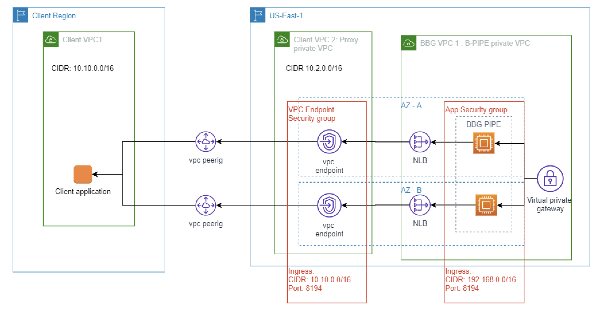
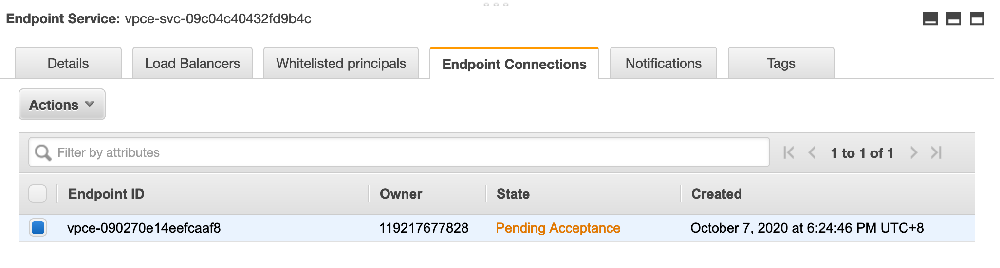
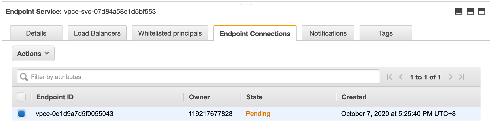
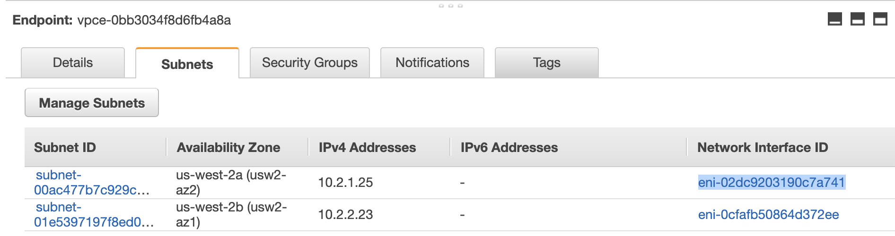
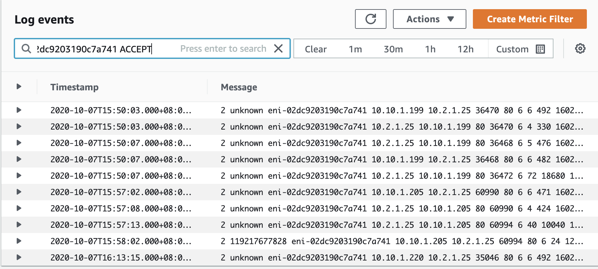

# Template of AWS Cross Region VPC-endpoint

## Background
This terraform project illustrates the AWS Cross Region VPC Interface endpoint (PrivateLink) implementation with VPC peering.

It referenced guideline from AWS:
https://docs.aws.amazon.com/vpc/latest/userguide/vpc-inter-region-peering-consumer-side.html

Main region = region of market data service hosted
Satellite region = region of data consumer located

### <u> Architecture diagram </u>


## MockProvider
A dummy HTTP SSE service streaming data at port 8194. <br>
This service is running on ECS fargate. <br>
It serves as a "MOCK" to check the vpc peering and vpc endpoint setup. <br>

### <u>Configuration</u>
It is maintained in "profilefargate.auto.tfvars". <br>

**Fargate Task docker image** <br>
docker image name of the dummy HTTP SSE service <br>
Example <br>
task_docker_image="192592784707.dkr.ecr.us-west-2.amazonaws.com/marketservice-sse:rc.java"

**White list principal**
White list principal to establish endpoint for data consumption
It is a list of ARN id of IAM principal. <br>
Example <br>
vpc_endpointsvc_allowed_principals=["arn:aws:iam::119217677828:user/TerraformDeploy"]

**Run Command**
```
cd MockProvider
terraform apply
```
**Expected output**
Outputs:
```
nlb_address = <load balancer dns name e.g. load-balancer-dd9cbd4dd36c99b8.elb.us-west-2.amazonaws.com>
vpc_endpoint_service_mktsvc_service_name = <vpc endpoint service name e.g. com.amazonaws.vpce.us-west-2.vpce-svc-013983b5873316d7c>
```

## ClientConsumer ###
Implement the AWS setup of AWS PrivateLink
### <u>Configuration</u>

**VPC Endpoint Service (PrivateLink) dns name**
DNS name of the VPC endpoint service (PrivateLink) for connection in main region
app_primary_endpoint_svc_name="com.amazonaws.vpce.us-west-2.vpce-svc-09c04c40432fd9b4c"

**S3 vpc endpoint log bucket**
ARN of S3 bucket as log data sink of vpc endpoint traffic
s3_vpc_endpoint_log_arn = "arn:aws:s3:::boargcp-vpcendpointlog"

**Run Command**
```
cd ClientConsumer
export VPC_PRIMARY_SERVICE_NAME=<vpc endpoint primary service name e.g. com.amazonaws.vpce.us-east-1.vpce-svc-0c078abf59c16d2a0>
export VPC_SECONDARY_SERVICE_NAME=<vpc endpoint secondary service name e.g. com.amazonaws.vpce.us-east-1.vpce-svc-0b2948573a91a6ddf>

#Setup the vpc endpoint for main region and network for both region first
terraform apply -target module.main -target module.satellite \
-var "app_primary_endpoint_svc_name=${VPC_PRIMARY_SERVICE_NAME}" \
-var "app_secondary_endpoint_svc_name=${VPC_SECONDARY_SERVICE_NAME}"

#setup vpc peering
terraform apply -var "app_primary_endpoint_svc_name=${VPC_PRIMARY_SERVICE_NAME}" \
-var "app_secondary_endpoint_svc_name=${VPC_SECONDARY_SERVICE_NAME}"
```

**Expected output**
DNS names of vpc endpoint for connections.

```
mkt_service_vpc_endpoint_dns_address = [
  {
    "dns_name" = "vpce-0d6b99e2c3337cc85-6snpjv75.vpce-svc-013983b5873316d7c.us-west-2.vpce.amazonaws.com"
    "hosted_zone_id" = "Z1YSA3EXCYUU9Z"
  },
  {
    "dns_name" = "vpce-0d6b99e2c3337cc85-6snpjv75-us-west-2b.vpce-svc-013983b5873316d7c.us-west-2.vpce.amazonaws.com"
    "hosted_zone_id" = "Z1YSA3EXCYUU9Z"
  },
  {
    "dns_name" = "vpce-0d6b99e2c3337cc85-6snpjv75-us-west-2a.vpce-svc-013983b5873316d7c.us-west-2.vpce.amazonaws.com"
    "hosted_zone_id" = "Z1YSA3EXCYUU9Z"
  },
]
```

### <u>Approve the VPC Endpoint connection in Mock application account </u>###
You will find state "Pending Acceptance" in the EndPoint service from AWS console

After approval, you find the state changing to "Pending"

Wait until the state turning to "Available"

### <u>Testing</u>
We would use curl to test the connection:
Notes:
You may receive following DNS error:<br>
<i>curl: (6) Could not resolve host:</i>
<br>
AWS may take minutes to update DNS records to all AWS running instances<br>
If you don't want to wait, you can use ip address of VPC endpoint instead <br>
```
curl -X GET '<vpc end point dns name>:8194/blp/mktdata?token=JWT1&sessionId=sessionid1&mktdatacode=XAUUSD+Curncy&fields=BID&fields=ASK'
```

**Expected result**
Streaming market data with HTTP Server Side Emit (SSE)
```
id:XAUUSD Curncy-1602139886640
event:XAUUSD Curncy-1602139886640-BID,
data:{"timestamp_ms":1602139886640,"mktdatacode":"XAUUSD Curncy","responseStatus":"OK","message":null,"valuesMap":{"BID":1893.44}}

id:XAUUSD Curncy-1602139886669
event:XAUUSD Curncy-1602139886669-ASK,
data:{"timestamp_ms":1602139886669,"mktdatacode":"XAUUSD Curncy","responseStatus":"OK","message":null,"valuesMap":{"ASK":1894.2}}

id:null-1602139886715
event:null-1602139886715-
data:{"timestamp_ms":1602139886715,"mktdatacode":null,"responseStatus":"EXPIRED","message":"sessionid1 session is not valid now","valuesMap":{}}
```


### Monitor VPC endpoint traffic with cloud watch ###
Monitor the VPC endpoint traffic.
First, we get the eni id

Then, we go to cloud watch
query the eni id


### Clean up ###
Clean ClientConsumer
```
cd ClientConsumer
terraform destroy
<note type any value twice to skip the vpc endpoint names>

cd MockProvider
terraform destroy
```

### Reference
https://binx.io/blog/2020/06/17/creating-multiple-resources-at-once-with-terraform-for-each/